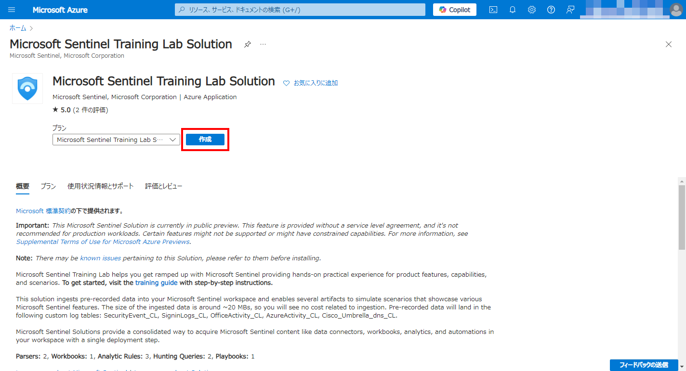

# Exercise01: Microsoft Sentinel 利用環境の準備

#### ⏳ 推定時間: 20分

#### 💡 学習概要

後続のすべてのモジュールで使用される Microsoft Sentinel トレーニング ラボ ソリューションのデプロイについて説明します。

#### 🗒️ 目次

1. [Log Analytics Workspace 作成](#log-analytics-workspace-作成)
1. [Microsoft Sentinel ワークスペース 作成](#microsoft-sentinel-ワークスペース-作成)
1. [Sentinel Training ラボ のデプロイ](#sentinel-training-ラボ-のデプロイ)
1. [Microsoft Sentinel プレイブックの構成](#microsoft-sentinel-プレイブックの構成)

## Log Analytics Workspace 作成

1. [Azure ポータル](https://portal.azure.com/) を開く
1. 上部の検索窓を使って Log Analytics Workspace を探して開く

    

1. 左上「作成」を選択

    

1. Log Analytics Workspace を開き、「作成」を選択
    1. 基本

        - リソースグループ: (任意の名前で新規作成)
        - 名前: (任意)
        - リージョン: (任意)
    
        

    1. タグ

        デフォルトまま（設定なし）

    1. 確認と作成

        「作成」を選択

        

## Microsoft Sentinel ワークスペース 作成

1. Azure ポータルを開き、上部検索窓から Sentinel を検索して開く

    

1. 左上「作成」を選択

    

1. 作成済のワークスペースを選択して「追加」

    

## Microsoft Sentinel Training ラボ のデプロイ

1. Azure ポータルを開き、上部検索窓から `Microsoft Sentinel Training Lab Solution` を検索して開く

    

1. 「作成」を選択

    

1. `Microsoft Sentinel Training Lab Solution` の作成
    1. 基本

        - リソースグループ: (作成したもの)
        - ワークスペース： (作成したもの)

        

    1. ワークブック, 分析, プレイブック

        デフォルトまま

    1. 確認と作成

        「作成」を選択

        

#### ～ デプロイ待ち (20-30分) ☕☕☕ ... ～

## Microsoft Sentinel プレイブックの構成

1. ラボがデプロイされたリソースグループへ移動

    

1. リソース グループにある `azuresentinel-Get-GeoFromIpAndTagIncident` という API 接続リソースを選択

    

1. [全般]-[API接続の編集] を開く

    

1. 「承諾する」を開き、「承諾する」を選択

    

1. ログイン画面が表示されるので、作業用のご自身のアカウントでログイン

    

1. 元の「API接続の編集」画面へ戻って、「保存」を選択

    

