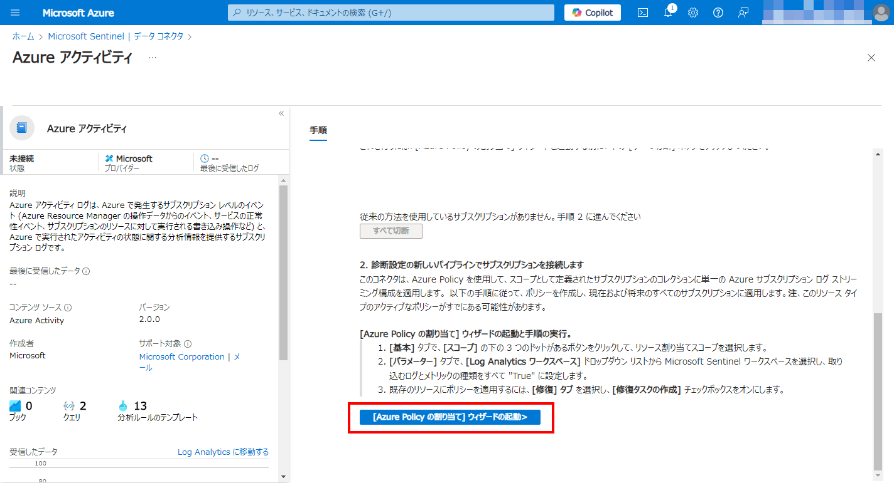
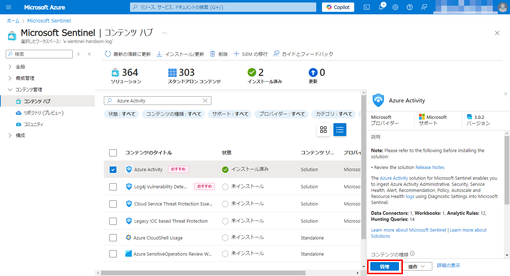

# Exercise02: データコネクタ

#### ⏳ 推定時間: 15分

#### 💡 学習概要

Microsoft Sentinel にデータ コネクタをインストールして有効にし、さまざまなソースからアラートやテレメトリを取り込む方法を学習します。

#### 🗒️ 目次

1. [Azure アクティビティ コネクタ を有効化](#azure-アクティビティ-コネクタ-を有効化)
1. [Microsoft Defender for Cloud データ コネクタ を有効化](#microsoft-defender-for-cloud-データ-コネクタ-を有効化)
1. [Microsoft Defender 脅威インテリジェンス コネクタを有効化](#microsoft-defender-脅威インテリジェンス-コネクタを有効化)

## Azure アクティビティ コネクタ を有効化

Azure アクティビティ データ コネクタを有効にする方法を解説します。
このコネクタは、Azure 管理プレーン アクティビティからログをインポートし、サブスクリプション内の Azure 管理アクティビティを追跡できるようにします。

1. [コンテンツ管理]-[コンテンツハブ] を開く

    

1. `Azure Activity` を検索して選択、「インストール」を実行

    

1. [構成]-[データコネクタ] を開く

    

1. `Azure Activity` を選択、「コネクターページを開く」を選択

    

1. 「手順」を下へスクロールして「構成」にある「[Azure Policy の割り当て]ウィザードの起動」を選択

    

1. ポリシーの割り当て

    1. 基本

        - スコープ: (ご自身のサブスクリプションを選択)

        

    1. 詳細

        デフォルトまま

        

    1. パラメーター

        - プライマリ Log Analytics ワークスペース: (今回のハンズオン用に作成したワークスペース)

        

    1. 修復

        - 修復タスクを作成する: `有効`
            - 修復ポリシー: `指定された Log Analytics ワークスペースにストリーミングするように Azure アクティビティ ログを構成`
        - マネージドID: `有効`
            - マネージドID の種類: `システム割り当て`
            - システム割り当てIDの場所: (Log Analytics ワークスペースと同じ場所)

        

    1. 非準拠メッセージ

        デフォルトまま

        

    1. 確認および作成

        「作成」を選択

        

1. [コンテンツ管理]-[コンテンツハブ] を開き、`Azure Activity` を検索して選択、「管理」を開く

    

1. 管理ビューを確認

    管理ビューには、ソリューションの内容が表示されます。
    ソリューション パックに含まれるコネクタ、分析ルール、ワークブック、ハンティング クエリ、その他のコンテンツがここに表示されます。
    これらがインストールされると、それぞれが Sentinel インターフェイスの関連セクションに表示されます (分析ルール テンプレート、ワークブック テンプレートなど)。

    

## Microsoft Defender for Cloud データ コネクタ を有効化

Microsoft Defender for Cloud データ コネクタを有効にする方法を説明します。
このコネクタを使用すると、Microsoft Defender for Cloud からのセキュリティ アラートを Microsoft Sentinel にストリーミングできるため、Defender からのアラートを組み込み、ブックで Defender データを表示し、インシデントを調査して対応することができるようになります。

**注意:** この演習を実行するには、以下が必要です。 
・ユーザーがサブスクリプションでセキュリティ リーダーロールを持っている必要があります。 
・Microsoft Defender for Cloud でいずれかの Defender プランを有効にする必要があります。

1. [コンテンツ管理]-[コンテンツハブ] を開き、`Microsoft Defender for Cloud` を検索して選択、「インストール」を実行

    

1. デプロイが完了したら「管理」を開く

    

1. `Subscription-based Microsoft Defender for Cloud` のデータコネクタを選択、「コネクタページを開く」を押下

    

1. 「構成」の「サブスクリプション」リストから、演習で利用するサブスクリプションを選択し、「接続」を選択

    

## Microsoft Defender 脅威インテリジェンス コネクタを有効化

Microsoft Defender Threat Intelligence ( MDTI ) コネクタを Sentinel ワークスペースに追加します。
これにより、Microsoft Threat Intelligence インジケーターが `ThreatIntelligenceIndicator` テーブルに自動的に取り込まれます。
MDTI は、一連のインジケーターと https://ti.defender.microsoft.com ポータルへのアクセスを追加料金なしで提供しますが、MDTI ポータルと API のプレミアム機能にはライセンスが必要です。

1. [コンテンツ管理]-[コンテンツハブ] を開き、`Threat Intelligence` を検索して選択、「インストール」を実行

    

1. デプロイが完了したら「管理」を開く

    

1. `Microsoft Defender Threat Intelligence` のデータコネクタを選択、「コネクタページを開く」を押下

    

1. 「接続」を選択

    

