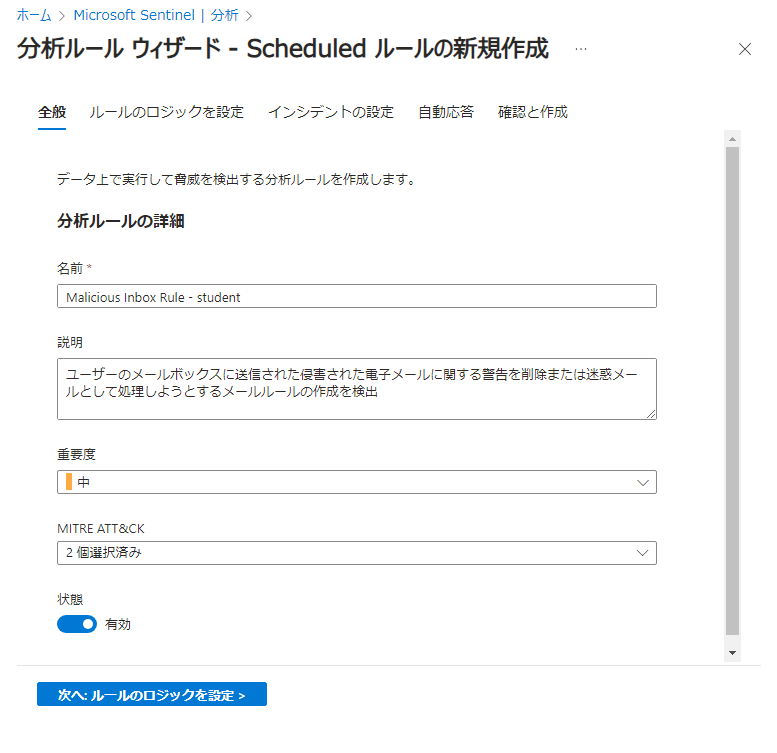

# Exercise03: 分析ルール

#### ⏳ 推定時間: 30分

#### 💡 学習概要

Microsoft Sentinel の分析ルールについて解説し、セキュリティ検出用のさまざまな種類のルールを作成する方法を学習します。

#### 🗒️ 目次

1. [Azure アクティビティ ルールを有効にする](#azure-アクティビティ-ルールを有効にする)
1. [Microsoft Defender for Cloud の Microsoft インシデント作成ルールを有効化](#microsoft-defender-for-cloud-の-microsoft-インシデント作成ルールを有効化)
1. [Fusionルール の確認（高度な多段階攻撃検出）](#fusionルール-の確認高度な多段階攻撃検出)
1. [Microsoft Sentinel カスタム分析ルールを作成する](#microsoft-sentinel-カスタム分析ルールを作成する)
1. [発生したセキュリティインシデントを確認](#発生したセキュリティインシデントを確認)


## Azure アクティビティ ルールを有効にする

Azure アクティビティ コンテンツ ソリューションを既にインストールしているため、含まれているルールの 1 つを有効にします。

1. [構成]-[分析] を開く

    

1. 「規則のテンプレート」タブへ遷移、「フィルターの追加」を選択して以下の条件でフィルタリング

    -  ソース名: `Azure Activity`

    

1. `Suspicious Resource deployment` を検索して開き、「ルールの作成」を選択

    

1. スケジュール済みクエリルールの作成

    1. 全般

        デフォルトまま

        

    1. ルールのロジックを設定

        以下の操作ができることを確認

        - クエリの右上にある矢印を選択してクエリ実装枠が広がる/縮小することを確認
        - 「クエリ結果の表示」を選択して、現在のクエリ動作確認ができることを確認
        - クエリのスケジュール設定を変更し、結果シミュレーションの「現在のデータでテストする」を選択することで

        

    1. インシデントの設定

        以下の操作ができることを確認

        - アラートのグループ化: Sentinel によって検出されたすべてのアラートをインシデントに昇格させる必要はありません。特にノイズの多いアラートはグループ化によって抑止するよう設定します。

        

    1. 自動応答

        デフォルトまま

        

    1. 確認と作成

        「保存」を選択

        


## Microsoft Defender for Cloud の Microsoft インシデント作成ルールを有効化

Microsoft Sentinel はクラウドネイティブの SIEM であり、アラートとイベントの相関関係を一元的に把握する役割を果たします。
この目的のため、また Microsoft セキュリティ製品からのアラートを取り込んで表示できるようにするために、Microsoft インシデント作成ルールを作成できます。
この演習では、この機能を確認し、フィルター オプションを有効にして、中程度および高程度の重大度の Defender for Cloud アラートのみを Sentinel インシデントに昇格させるサンプル ルールを 1 つ作成し、アナリストのアラート疲労を軽減します。

**注意:** 
Exercise2 では、 Microsoft Defender for Cloud コネクタを追加しました。
これにより、Microsoft Defender for Cloud のセキュリティ アラートが Sentinel と同期されます。
ルールの作成 (以下で説明) はコネクタを有効にしなくても実行できますが、コネクタがないとアラートが取り込まれたり、昇格されたりすることはありません。

1. [構成]-[分析] を開く

    

1. 「作成」を開き、[Microsoft インシデントの作成規則] を選択

    

1. 分析ルールの作成

    1. 全般

        - 名前: `Defender for Cloud - 中および高アラートのみ`
        - 説明: (任意。空欄でも可)
        - 状態: `有効`
        - Microsoft のセキュリティサービス: `Microsoft Defender for Cloud`
        - 重要度でフィルター: `カスタム` -> `中` と `高` を選択

        

    1. 自動応答

        デフォルトまま

        

    1. 確認と作成

        「保存」を選択

        


## Fusionルール の確認（高度な多段階攻撃検出）

Fusion ルールを使用すると、Microsoft Sentinel は、キル チェーン全体のさまざまな段階で観察される異常な動作と疑わしいアクティビティ/アラートの組み合わせを識別することで、多段階攻撃を自動的に検出できます。

1. [構成]-[分析] を開く

    

1. 「規則のテンプレート」タブへ移動し、「フィルターの追加」を選択して以下の条件でフィルタリング

    - ルールの種類: `Fusion`

    

1. `Advanced Multistage Attack Detection` を選択して右ペインで内容(利用するデータソース)を確認

    Microsoft 365 Defender, Microsoft Defender for Endpoint, Identity, Office 365 など、複数のデータソースを元にインシデントを作成していることが確認できます。

    


## Microsoft Sentinel カスタム分析ルールを作成する

#### シナリオ

セキュリティ コンサルタントは、オンラインで読んだスレッド ( [reddit - Recent phishing attempts - My experience and what to look out for.](https://www.reddit.com/r/sysadmin/comments/7kyp0a/recent_phishing_attempts_my_experience_and_what/) など。以下の "参考" にまとめ) から、悪意ある 受信メールルール の操作に関する情報を発見しました。
オンライン情報にて説明されている攻撃ベクトルは次のようになっていました。

- オフィス活動
- 新しい受信メールルールの作成
- 作成中のルールに含まれる特定のキーワード

攻撃ベクトルと組織のリスクに基づいて、この悪意あるアクティビティに対する検出ルールを作成することにしました。
この演習では、Microsoft Sentinel 分析ルール ウィザードを使用して新しい検出ルールを作成します。

#### 注意

このラボでは、トレーニング ラボのインストールにてオンボードしたカスタム ログを使用し、通常のテーブル名とデータ タイプをカスタム データ ソースに置き換えます。
Sentinel トレーニング ラボ コンテンツ パッケージでは、参考として以下で説明するカスタム ルールも追加されます。

#### 参考: 最近のフィッシング攻撃

- 攻撃の手口:
    - PDF添付ファイルを使い、埋め込みリンクで偽のGoogleログインページに誘導。
    - ユーザーの資格情報を盗むための手口が多く見られた。
- 攻撃の影響:
    - 多くのユーザーが騙され、資格情報を漏洩。
    - メールボックスに「削除」ルールを設定し、警告メールを削除することで被害の拡大を図る。


### 検出を設定する

1. 上記のリンクの記事を確認し、検出に必要なデータ ソースを検討

1. データ収集がすでに行われているか確認

    1. [全般]-[ログ] を開く

        

    1. 以下のクエリを入力して「実行」、 Sentinel に取り込まれたアクティビティのリストを確認

        クエリ入力できない場合、右上のモードを `KQLモード` に変更します。

        ```
        OfficeActivity_CL
        | distinct Operation_s
        | sort by Operation_s asc;
        ```
        

    1. `New-InboxRule` が取り込まれていることを確認

        Exchange の "受信トレイルール 新規作成" のルールが取り込まれていることが確認できます。

        

1. スケジュール済クエリの作成

    1. [構成]-[分析] を開く

        

    1. 「作成」を開き、「スケジュール済みクエリルール」を選択

        

    1. スケジュール済みクエリルールの作成

        1. 全般

            - 名前: `Malicious Inbox Rule - student`
            - 説明: `ユーザーのメールボックスに送信された侵害された電子メールに関する警告を削除または迷惑メールとして処理しようとするメールルールの作成を検出`
            - 重要度: `中`
            - MITRE ATT&CK: `Persistence` と `Defense Evasion` を選択
            - 状態: `有効`

            

        1. ルールのロジックを設定

            - ルールのクエリ

                以下のKQLを入力。
                「現在のデータでテスト」を選択して動作確認をする。

                ```
                let Keywords = dynamic(["helpdesk", " alert", " suspicious", "fake", "malicious", "phishing", "spam", "do not click", "do not open", "hijacked", "Fatal"]);
                OfficeActivity_CL
                | where Operation_s =~ "New-InboxRule"
                | where Parameters_s has "Deleted Items" or Parameters_s has "Junk Email" 
                | extend Events=todynamic(Parameters_s)
                | parse Events with * "SubjectContainsWords" SubjectContainsWords '}'*
                | parse Events with * "BodyContainsWords" BodyContainsWords '}'*
                | parse Events with * "SubjectOrBodyContainsWords" SubjectOrBodyContainsWords '}'*
                | where SubjectContainsWords has_any (Keywords)
                or BodyContainsWords has_any (Keywords)
                or SubjectOrBodyContainsWords has_any (Keywords)
                | extend ClientIPAddress = case( ClientIP_s has ".", tostring(split(ClientIP_s,":")[0]), ClientIP_s has "[", tostring(trim_start(@'[[]',tostring(split(ClientIP_s,"]")[0]))), ClientIP_s )
                | extend Keyword = iff(isnotempty(SubjectContainsWords), SubjectContainsWords, (iff(isnotempty(BodyContainsWords),BodyContainsWords,SubjectOrBodyContainsWords )))
                | extend RuleDetail = case(OfficeObjectId_s contains '/' , tostring(split(OfficeObjectId_s, '/')[-1]) , tostring(split(OfficeObjectId_s, '\\')[-1]))
                | summarize count(), StartTimeUtc = min(TimeGenerated), EndTimeUtc = max(TimeGenerated) by  Operation_s, UserId__s, ClientIPAddress, ResultStatus_s, Keyword, OriginatingServer_s, OfficeObjectId_s, RuleDetail
                ```

                

            - エンティティ マッピング

                以下の新しいエンティティを追加

                |エンティティ|左 識別子|右 識別子|
                |---|---|---|
                |アカウント|`FullName`|`UserId_s`|
                |ホスト| `FullName` | `OriginatingServer_s` |
                |IP| `Address` | `ClientIPAddress` |

                
            
            - アラートの詳細

                - アラート名の形式: `Malicious Inbox Rule - {{UserId__s}}`
                - アラートの説明の形式: (任意)

                

            - クエリのスケジュール設定

                - クエリの実行間隔: `5分`
                - 過去データの参照: `12時間`

                

        1. インシデントの設定 ～ 自動応答

            デフォルトまま

        1. 確認と作成

            「保存」を選択

            


## 発生したセキュリティインシデントを確認

このトレーニング ラボ コンテンツがオンボードされたときにインストールされ実行された分析ルールによって生成されたインシデントを確認してみましょう。

1. [脅威管理]-[インシデント] を開く

    

1. `Malicious Inbox Rule, affected user AdeleV@contoso.OnMicrosoft.com` などのタイトルのインシデントを検索、選択

    ユーザー名は影響を受けるユーザー名によって変化

    

1. 右側ペインでインシデントの概要を確認

    - 上部: タイトル、ID、ユーザーへの割り当て、ステータス (新規/アクティブ/クローズ)、重大度
    - 説明: ルールによって提供される説明（適切な説明を提供することで、アナリストが検出内容を理解するのに役立ちます）
    - 製品名のアラート: 関連する Alert 製品 (ここでは Sentinel のみ)
    - 証拠: インシデントに追加されたイベント、アラート、ブックマークの数とクイックリンク
    - 最終更新時間、作成時刻: インシデントの更新日時および作成日時
    - エンティティ: インシデントに関連する アカウントのエンティティ ページへのクイック リンク (ここでは Adele のアカウントですが、ホスト、IP なども含まれる場合もあります)
    - 戦術と手法: ルール定義で指定した MITRE ATT&CK
    - インシデントブック: インシデントの概要に関するライブレポートを提供するワークブックへのリンク
    - タグ: クイックタグ付けとタグ表示
    - インシデントリンク: インシデントへの直接リンク
    - 最新のコメント: インシデントにつけたコメント（存在する場合）

    

1. 「すべての詳細を表示」を開く

    

1. 完全なインシデント情報を確認

    - 左ペイン: インシデント概要
    - 右上 インシデントアクション
    - 概要 タブ:
        - インシデントタイムラインパネル: タイムラインビューでそのインシデントに関連するアラートとブックマークを表示
        - エンティティパネル: エンティティタブのエンティティの簡易表示
        - 類似インシデント: 類似インシデントを一覧表示。コンテキストが追加されている場合のみ表示。
        - 上位の分析情報: 利用可能な場合に表示
    - エンティティ タブ: 
        - 関連するエンティティを一覧。検索および詳細の確認が可能。
    
    

1. 「エンティティ」タブへ移動、 `AdeleV@contoso.OnMicrosoft.com` を選択

    各エンティティを選択するとより詳細な情報が取得可能です。

    エンティティ情報はさまざまなソースから取得されます。
    一部は Azure サービス (Microsoft Entra ID や Azure Virtual Machine ホスト情報など) から直接取得され、一部はオンボード データ ソースから、一部は UEBA (有効な場合) から取得されます。
    偽のユーザーであるAdeleVの場合、ユーザー ディレクトリには情報がありませんが、運用環境では通常、さらに多くの情報が利用できることに注意してください。

    - 情報: エンティティに関連する基礎情報
    - タイムライン: 関連するインシデントのタイムライン
    - 分析情報: 分析情報があれば表示

    
    
    