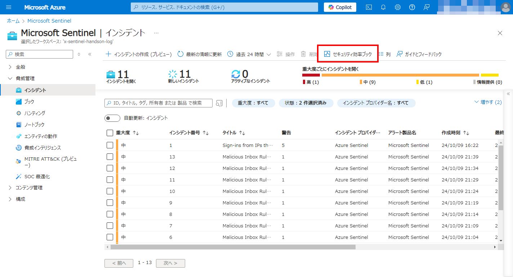
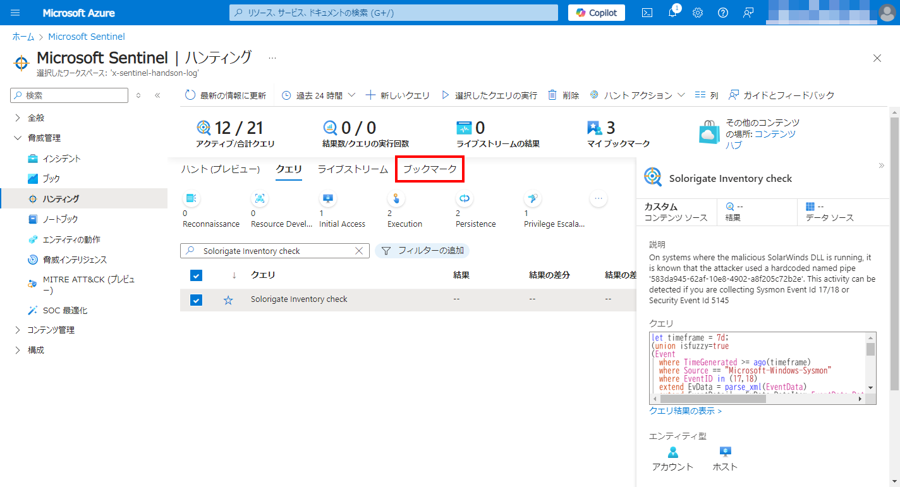
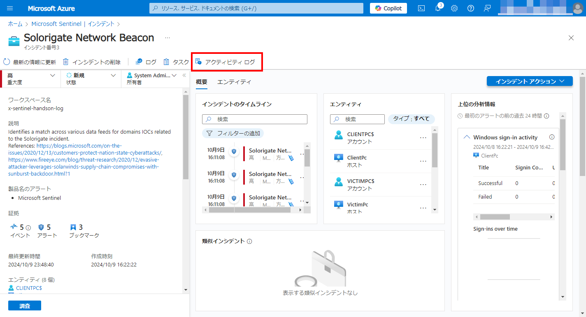

# Exercise04: インシデント管理

#### ⏳ 推定時間: 60分

#### 💡 学習概要

Microsoft Sentinel のインシデント管理機能を使用した SOC アナリストのエクスペリエンスについて学習します。

#### 🗒️ 目次

1. [Microsoft Sentinel インシデント ツールと機能の確認](#microsoft-sentinel-インシデント-ツールと機能の確認)
1. [インシデント「無効なアカウントに対するサインイン試行」の対応](#インシデント無効なアカウントに対するサインイン試行の対応)
1. [インシデント「Solorigate ネットワーク ビーコン」の対応](#インシデントsolorigate-ネットワーク-ビーコンの対応)


## Microsoft Sentinel インシデント ツールと機能の確認

SOC アナリストとして、Sentinel でセキュリティ インシデント (チケット/ジョブ/ケースなど) に取り組むためのエントリ ポイントは、インシデントページです。

1. [脅威管理]-[インシデント] を開く

    

1. インシデント一覧画面の機能確認

    インシデント一覧画面について、以下を確認します。

    - デフォルト期間: インシデントページはデフォルトで過去 24 時間以内に発生したすべてのインシデントが表示されます。
    - その他利用可能なフィルタリング
        - 時間枠
        - 重大度
        - 状態　　…など

    

1. インシデント担当者を設定

    あなたはインシデントを調査している SME SOC アナリストです。
    対応が必要なインシデントを探し、所有権を取得する必要があります。

    1. インシデント一覧ページにて、 `Sign-ins from IPs that attempt sign-ins to disabled accounts` を検索して選択

        

    1. インシデントの担当者を選択、「自分への割り当て」を選択、「適用」

        

1. インシデント対応状況の確認

    業務進捗の確認のため、一般的な SOC の健全性に関する概要を取得する必要があります。
    セキュリティ効率ブックを利用して状況確認します。

    1. インシデント一覧ページ上部にある「セキュリティ効率ブック」を開く

        

    1. インシデントの発生状況、対応状況などを確認

        


## インシデント「無効なアカウントに対するサインイン試行」の対応

インシデント処理手順の例を順に説明し、SOC アナリストが Sentinel を使用して達成できるいくつかのことを説明します。

#### 最初のインシデント処理

1. [脅威管理]-[インシデント] を開き、`Sign-ins from IPs that attempt sign-ins to disabled accounts` を検索して選択

    

1. 右ペインから所有者を取得し、状態をアクティブに変更

    1. 「所有者」を開き「自分への割り当て」を選択して「適用」

        

    1. 「状態」を開き「アクティブ」を選択して「適用」

        

1. 右ペインの「すべての詳細を表示」を開く

    

1. 「概要」の「インシデントのタイムライン」から最新インシデントを選択、「イベント」にある「LA (Log Analytics) にリンク」を開く

    ログが検索され、インシデントと判断されたログを確認

    

1. ログパネルで以下の情報を確認

    これらのプロパティは、このインシデントが他のイベントと相関しているかどうかを判断するのに役立つ場合があります。

    - IPAddress
    - disabledAccountSet

    

1. 「完了」を選択してログパネルを閉じる

    

1. 「概要」の「エンティティ」に先ほど確認した IPアドレス ( `175.45.176.99` ) があることを確認、選択

    

1. IPアドレスの詳細情報を確認

    - Gelocation information
        - Country: Korea (North) (北朝鮮)
        - City: Pyeongyang (平壌)

    

これらの情報から北朝鮮から不正アクセスがあったことがわかります。


#### ワークブックで継続調査

SOC アナリストとして、地理情報から不正アクセスの懸念が高まりました。
ネットワーク内でこの IP の他の痕跡を確認する必要があります。
この調査には、 Investigation Insights ワークブック を使用します。
(トレーニング ラボによって、既にワークスペースにコピーが保存されています。)

1. [脅威管理]-[ブック] を開く

    

1. 「マイ ブック」タブを開き、 `Investigation Insights` を選択、右ペインから「保存されたブックの表示」を開く

    

1. 上部プロパティの設定を確認

    - Subscription: (今回の演習で利用しているサブスクリプション)
    - Workspace: (今回の演習用に作成した Log Analytics Workspace)
    - TimeRange: (演習用の Log Analytics Workspace を作成した日が含まれる期間)

    

1. 下へスクロールして「Entity Insights」の「Investigate IP Address」に調査で判明したアクセス元IPアドレス `175.45.176.99` を入力

    

1. 下へスクロールして「Activity Detail」を確認

    このIPから `adelev@m365x816222.onmicrosoft.com` に対する複数のログイン試行があったことがわかります。

    

1. ユーザー ID `adelev@m365x816222.onmicrosoft.com` の調査 ...

    ユーザーIDをコピーし、社内の HR システムで検証したところ、
    収集した情報から、Adele は Security Red Team のメンバーであり、
    この疑わしい行動は 48 時間にわたって実行されている演習の一部であることが判明しました。


#### 調査結果を踏まえた対応の実施

Security Red Team の演習が当社によって発見されたため、
SOC マネージャーは、テストの実行中にこの IP からのインシデントの調査に時間を費やさないように、
この検出タイプに対してこの IP を許可リストに登録するよう依頼しました。
ルール定義自体を編集するのではなく、インシデント自動化ルールを使用します。

1. [脅威管理]-[インシデント] を開く

    

1. `Sign-ins from IPs that attempt sign-ins to disabled accounts` を検索して選択、右ペイン [操作]-[オートメーション ルールの作成] を選択

    

1. オートメーション ルールの作成

    新しい自動化ルール画面では、現在のインシデント識別子 (IP と特定の Analytics ルール名) が条件として事前に入力されています。
    Security Red Team の演習は約 48 時間で終了するため、その期間の終了時にルールの有効期限を設定し、
    「適用」を押下します。
    
    - オートメーションルール名: `Sign-ins from IPs that attempt sign-ins to disabled accounts`
    - トリガー: `インシデントが作成されたとき`
    - 条件
        - `インシデントプロバイダー` `次と等しい` `すべて`
        - `分析ルール名` `次を含む` `Sign-ins from IPs that attemptto sing-in disabled account`
        - `IPアドレス` `次と等しい` `175.45.176.99`
    - 操作
        - 状態の変更
        - 終了
        - 無害な陽性 - 不信ですが、予期されています
        - コメント: (任意)
    - ルールの有効期限
        - 48時間後に設定 ★←ここを修正★
    - 状態: `有効`

    

1. インシデントへ戻り、右ペイン「状態」を開き、ステータス変更してインシデントを閉じる

    インシデントは Security Red Team の演習によるもので、
    無害であることが判明したため、終了します。

    以下を設定して「適用」を選択

    - 状態: `終了`
    - 分類: `無害な陽性`
    - コメント: `Security Red Team による演習`

    


## インシデント「Solorigate ネットワーク ビーコン」の対応

インシデント処理手順の例を順に説明し、
SOC アナリストが Sentinel を使用して達成できるいくつかのことを説明します。


(*) 参考: Solorigate攻撃

    Solorigate攻撃は、2020年末に発覚した SolarWinds 社の製品をターゲットにした攻撃です。
    攻撃者は同社のサーバーに侵入し、何らかの方法で Orion Platform の ソフトウェア 更新パッケージに バックドアを挿入しました。
    SolarWindsのOrion Platformは多くの企業や政府機関で広く使用されており、
    利用していた組織にはアメリカ合衆国政府機関や多国籍企業が含まれていました。
    更新パッケージが配布されると攻撃者は Orion Platform 利用組織に対して不正アクセスし、機機密報などの盗難を行いました。

#### 最初のインシデント処理

1. [脅威管理]-[インシデント] を開く

    

1. `Solorigate Network Beacon` を検索して選択

    

1. 右ペインで担当を自分に変更して「適用」を選択

    

1. 右ペインの「説明」を確認

    Solorigate 攻撃に関連するドメイン IOC の 1 つが見つかりました。
    このケースでは、ドメイン `avsvmcloud.com` が関係しています。

    

1. 右ペインの「すべての詳細を表示」を開く

    

1. 「概要」にある「インシデントのタイムライン」から任意のインシデントを選択、「LAへのリンク」を開く

    

1. インシデントの元となったログを確認

    ご覧のとおり、イベントは `Cisco Umbrella DNS` で発生していることがわかります。
    分析ルール Advanced Security Information Model (ASIM) によって
    任意の DNS ソースからのイベントが EventProduct や EventVender などに正規化されています。
    詳細については [ASIM](https://learn.microsoft.com/azure/sentinel/normalization) と [DNS スキーマ](https://learn.microsoft.com/azure/sentinel/normalization-schema-dns) を参照してください。

    


#### 追加調査

侵害を受けた可能性のあるホストを特定します。
調査の中で、[Microsoft からの ガイダンス](https://techcommunity.microsoft.com/t5/azure-sentinel/solarwinds-post-compromise-hunting-with-azure-sentinel/ba-p/1995095) を見つけました。
この記事には、SolarWinds インベントリ チェックを実行するクエリが記載されています。
このクエリを使用して、影響を受けた他のホストを検索します。

1. [脅威管理]-[ハンティング] を開き、「クエリ」タブへ移動

    

1. `Solorigate Inventory check` を探して選択、右ペインから「クエリの実行」を押下

    

1. ハンティング一覧の「結果」または右ペイン上部の「結果」に数値 (`3`) が出ていることを確認し、右ペインから「結果の表示」を押下

    

1. ログペインの内容を確認

    ご覧のとおり、ClientPC のほかに、
    悪意のある DLL と名前付きパイプが見つかったコンピュータが 2 台あります。

    

1. レコード3行を選択し、「ブックマークの追加」を選択

    

1. ブックマークの作成

    以下の修正を行って「作成」を選択

    - ブックマーク名: `Solorigate Inventry check`
    - イベント時間のマッピング: `timestamp`
    - エンティティマッピング:
        - `アカウント`: `FullName` `AccountCustomEntity`
        - `ホスト`: `FullName` `HostCustomEntity`

    

1. 右上「×」を選択して、[脅威管理]-[ハンティング] に戻る

    

1. 「ブックマーク」タブへ移動

    

1. ブックマークした3件を選択し、上部メニュー [インシデントアクション]-[既存のインシデントに追加] を選択

    

1. リストから自分に割り当てられている Solorigate インシデント を選択、「追加」を押下

    


この時点で、運用チームに依頼し、このインシデントの影響を受けたホストを隔離します。

Note: 実際のSOCでは、この手順はPlaybookを使用して自動化できる可能性があります。


#### 侵害インジケーター へ IPアドレス 追加

インシデントに関連するIPアドレスをSentinelワークスペースの脅威インテリジェンスストアの侵害インジケーター(Indicators of Compromise, IOC)リストに追加して、
ログ全体でこのIOCの新たな発生をキャプチャできるようにします。

1. [脅威管理]-[インシデント] を開く

    

1. `Solorigate Network Beacon` インシデントを選択、「すべての詳細を表示」を開く

    
   
1. 関連する IPアドレス (`17.81.146.1`) をコピー

    

1. [脅威管理]-[脅威インテリジェンス] へ移動

    

1. 上部メニュー「新規追加」を選択

    

1. 新しいインジケーターの作成

    以下の設定を行って「適用」

    - 種類: `ipv4-addr`
    - IPv4 アドレス: `17.81.146.1`
    - 脅威の種類: `malcious-activity`
    - 説明: `Solorigateキャンペーン関連`
    - 名前: `mal_ip: 17.81.146.1`
    - 取り消し済み: `false(チェックしない)`
    - 信頼度: `90`
    - キルチェーン: (設定なし)
    - 有効期限の開始日: (本日の日付)
    - 有効期限: (2ヶ月後)
    - 作成者: (自分のアカウント)

    


#### インシデントの引き渡し

インシデントを別のチーム(オペレーションやフォレンジックなど)に引き渡すために、
行ったことが文書化されていることを確認する準備をします。

1. [脅威管理]-[インシデント] へ移動

    

1. `Solorigate Network Beacon` インシデントを選択、「すべての詳細を表示」を開く

    

1. 上部メニュー「アクティビティログ」を開く

    

1. 右ペイン下部のコメント欄に実行したことを記載して「コメント」を選択

    ```
    以下のステップを実行しました：
    1. Solorigate攻撃に関連するドメインへのネットワークビーコンを特定
    2. ハンティングクエリを使用して、影響を受けたホストを特定
    3. 影響を受けたホストをさらに2つ検出
    4. インシデントに証跡（エビデンス）を追加
    5. 脅威インテリジェンスにIPアドレスIOCを追加
    6. 隔離のためオペレーション・チームに引き渡し
    ```

    

この時点で、インシデントを適切なチームに引き継ぎます。
インシデントを引き継ぐためには、次のような操作が実行できます。

- インシデント プレビューの下部から直接リンクをコピーして担当者へ連絡
- インシデントを個人またはチームのエイリアスに直接割り当て


